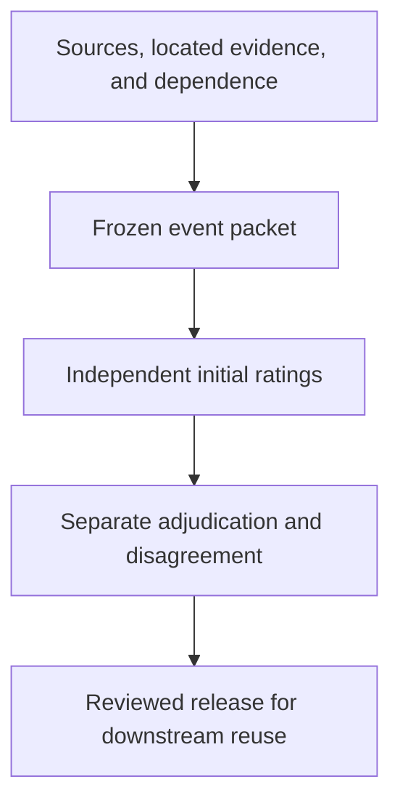

<p align="center"><strong>NODE &amp; NORM · RESEARCH INFRASTRUCTURE</strong></p>

<h1 align="center">Control Evidence Corpus</h1>

<p align="center">What can the surviving evidence tell us about an AI control?</p>

<p align="center">
  <a href="research/README.md">Research brief</a> ·
  <a href="examples/dossiers/override-unresolved.md">Explore a dossier</a> ·
  <a href="docs/README.md">Methods &amp; documentation</a>
</p>

[](https://github.com/node-and-norm/node-norm-control-evidence/actions/workflows/validate.yml)

An investigation says a human could intervene. A trace records an override command. Neither statement, on its own, establishes that the command changed what the system did.

**The Control Evidence Corpus (CEC) makes that evidentiary boundary inspectable.** It connects each control proposition to a dated source, a precise evidence location, and a preserved judgment. Its research question is whether independent reviewers can use those records to reconstruct control operation reliably.

> [!IMPORTANT]
> **Development infrastructure · 0.1.0-dev.** Three synthetic demonstrations and one unrated source-reconnaissance note are available. There are **zero independently coded empirical events** and **no approved corpus release**. Software checks do not establish scientific validity.

## See the distinction

These are invented demonstrations of the data contract. They are not study results.

| Surviving record | Proposition | Recorded value | Inspect |
| :--- | :--- | :--- | :--- |
| An override command; no downstream acknowledgement | Did the action propagate? | `not_reported` | [Unresolved override](examples/dossiers/override-unresolved.md) |
| A command and a downstream stop acknowledgement | Did the action propagate? | `yes` | [Acknowledged stop](examples/dossiers/override-confirmed.md) |
| A policy assigning an approval role; no runtime record | Was intervention attempted? | `not_reported` | [Declared authority](examples/dossiers/policy-only.md) |

A missing record stays distinguishable from an affirmative finding that a control did not operate. Even a documented stop leaves mitigation unresolved without evidence about consequences and alternatives.

**For a real source:** the [Tempe reconnaissance note](research/reconnaissance/tempe.md) shows why a documented takeover route, a timed action, and a safety outcome need separate questions. It is an AI-assisted source map awaiting independent review.

## The contribution to test

The candidate gap is **reproducible reconstruction of individual control opportunities from incomplete, dependent public evidence**. Existing work already addresses incident uncertainty, audit evidence, human oversight, safety arguments, and AI forensics. The [novelty review](research/NOVELTY_REVIEW.md) records substantial overlap and unresolved comparisons.

CEC earns a research contribution only if it improves what reviewers can establish, or yields a defensible finding about the limits of reconstruction.

| Test | Comparison or evidence | What would count against CEC |
| :--- | :--- | :--- |
| Added value | Same packets presented as a narrative, a simple checklist, and CEC | No useful gain in supported reconstruction, or excessive preparation and review burden |
| Reproducibility | Independent control enumeration and initial human ratings | Unstable control boundaries or persistent category confusion |
| Validity | External construct review; later controlled cases with known states | Reliable labels that fail to distinguish the intended control states |
| Reuse | Exact-version records with retained uncertainty and corrections | Downstream interpretation loses provenance or turns missingness into certainty |

Read the [comparative pilot design](research/COMPARATIVE_PILOT_DESIGN.md) and [research decision gates](research/README.md#decision-gates). Thresholds and study roles remain unfilled; no favorable result is presumed.

## Follow the evidence



Each analytical observation binds **one event, one control objective, one opportunity, and one relevant period**. A source claim remains separate from a researcher judgment. Review and release steps in this diagram are research requirements; the executable demonstration uses synthetic records.

## Find your path

| If you want to… | Start here | Then inspect |
| :--- | :--- | :--- |
| Assess whether this deserves a study | [Research brief](research/README.md) | [Pressure test](research/PRESSURE_TEST_2026-09-14.md) |
| Understand a record | [Example gallery](examples/README.md) | [Codebook](docs/methods/CODEBOOK.md) |
| Help run the pilot | [Pilot workbench](research/pilot/README.md) | [Sampling](docs/methods/SAMPLING_PLAN.md) · [Reliability](docs/methods/RELIABILITY_PLAN.md) |
| Inspect or extend the implementation | [Reproducibility guide](docs/reference/REPRODUCIBILITY.md) | [Schemas](schemas/README.md) |
| Use future findings | [Integration contract](docs/reference/INTEGRATION_CONTRACT.md) | [Data and rights](docs/policies/DATA_STATEMENT.md) |
| Review the research authority | [Charter](RESEARCH_CHARTER.md) · [Agenda](RESEARCH_AGENDA.md) | [Governance](GOVERNANCE.md) |

## Run the demonstration

Python 3.11 or later; one pinned dependency. No model credentials or external inference service required.

```sh
python3 -m pip install -r requirements.txt
python3 scripts/validate.py examples/synthetic.json
python3 scripts/render_dossier.py examples/synthetic.json --view review --output build/dossier.md
python3 -m unittest discover -s tests -v
```

The renderer produces a readable, explicitly synthetic dossier. The [full workflow](docs/reference/REPRODUCIBILITY.md) reproduces every example and checks documentation links. Empirical publication remains unavailable in this development implementation.

<details>
<summary><strong>Repository map</strong></summary>

```text
research/       Contribution, literature, comparative pilot, source reconnaissance
examples/       Runnable synthetic bundles, generated dossiers, blind packet views
docs/
  methods/      Constructs, codebook, sampling, reliability, validation
  policies/     Sources, rights, ethics, data, AI use
  reference/    Reproduction, downstream contract, continuation provenance
schemas/        Explicit object contracts
scripts/        Validation, rendering, example generation, synthetic export
tests/          Research-integrity and presentation safeguards
data/           Reserved for reviewed empirical records; currently empty
```

The [documentation index](docs/README.md) covers every governing and supporting document. The original Charter and Agenda remain at the root, with section navigation added.

</details>

---

**Next milestone:** a reviewable, staffed development pilot. Track concrete prerequisites in the [roadmap](ROADMAP.md). Contribute through [documented review](CONTRIBUTING.md); cite the exact development commit using [CITATION.cff](CITATION.cff).
