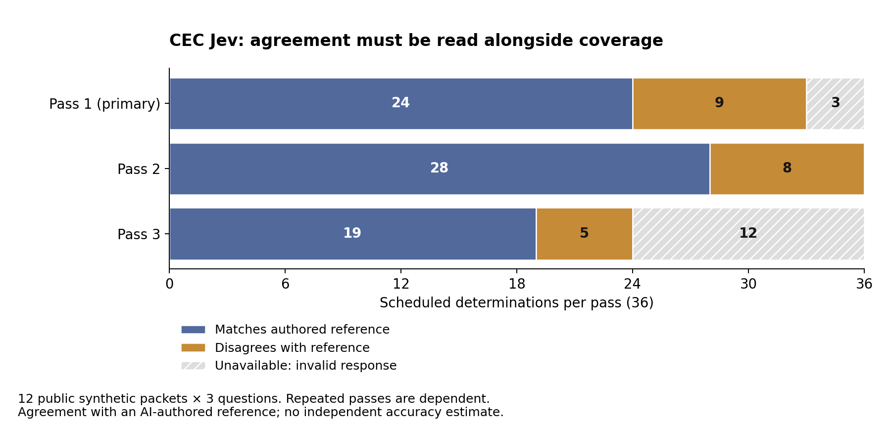

# Inspecting the development results

The primary pass contains 24 matches, nine mismatches and three unavailable determinations. Pass 2 contains 28, eight and zero; pass 3 contains 19, five and twelve. The [CSV](cec-live-counts.csv) provides an accessible table; the [SVG](cec-live-overview.svg) can be reused in presentations. Every bar retains all 36 scheduled determinations. Invalid requests make all three of their answers unavailable.

These are results on twelve related, invented packets. Agreement is measured against an AI-authored, unreviewed reference. The [boundary review](../../experiments/jev-cec/execution-v1/BOUNDARY-REVIEW.md) explains why disagreements cannot all be treated as model errors. Repeated passes supply neither independent samples nor evidence of improvement over time. There are no population confidence intervals or fitted capability trends.

## Formulas and denominators

For pass t, let N_t be scheduled determinations, V_t valid determinations and M_t matches with the frozen reference. Report both:

$$C_t=V_t/N_t,\qquad A_t=M_t/V_t.$$

Coverage C and conditional agreement A answer different questions. A is undefined when V is zero. The plotted unavailable count is N minus V; it is not a count of incorrect classifications.

For eight classes and reference label y, the per-item Brier loss is:

$$B_i=\sum_{k=1}^{8}(p_{ik}-\mathbf{1}[y_i=k])^2,\qquad \bar B_t=\frac{1}{V_t}\sum_{i\in\mathrm{valid}(t)}B_i.$$

The sum is not divided by eight. Loss is relative to the authored reference, with range zero to two for valid probability vectors. It does not establish calibration against an external truth. Mean loss is undefined when no answers are valid.

Complete-triplet repeatability is the proportion of card-dimension groups with the same label in all three valid passes: 23/24, with 12/36 groups excluded. Agreement can repeat an unsupported interpretation.

## Reproduce

Install the optional plotting dependency with `python -m pip install matplotlib==3.10.7`, then run `python scripts/plot_cec_live.py` from the repository. It reads only the preserved live report, exports the plotted counts and renders both formats. Matplotlib 3.10.7 produced these figures. Rendering bytes can vary with platform and fonts; the CSV counts are exact.

The figure uses conventional evaluation-report design: explicit sample counts, complete denominators and visible missingness. It does not reproduce a METR metric or claim METR affiliation. Task-duration horizons, scaling curves and causal claims would require a different study and data.
