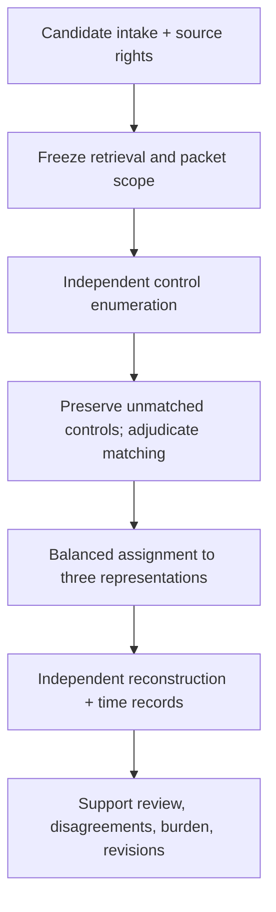

# Pilot workbench

[Repository](../../README.md) / [Research](../README.md) / Pilot

**Use this directory to prepare attributable research work.** The files are blank instruments and an open decision register. Their presence does not mean a pilot has started.

## Before allocating cases

| Requirement | Working artifact | State |
| :--- | :--- | :--- |
| Define retrieval budget, eligibility, and deduplication | [Protocol decisions](protocol-decisions.csv) | Open |
| Record candidate scope and source access | [Candidate intake](templates/candidate-intake.csv) | Blank |
| Capture independent control enumeration | [Enumeration worksheet](templates/control-enumeration.csv) | Blank |
| Record support judgments and time | [Reconstruction review](templates/reconstruction-review.csv) | Blank |
| Recruit assessors and separate roles | Eligibility, conflicts, exposure, and acceptance records held under appropriate access | Unassigned |
| Define support-scoring rules and worthwhile benefit | [Draft support rubric](SUPPORT_RUBRIC.md) and precision rationale, reviewed before allocation | Rubric drafted; human review, benefit threshold, and precision rationale pending |

## Workflow

This is a proposed development workflow, not an implemented enrollment system. Follow the [comparative design](../COMPARATIVE_PILOT_DESIGN.md), [sampling plan](../../docs/methods/SAMPLING_PLAN.md), and [reliability plan](../../docs/methods/RELIABILITY_PLAN.md).

## Instrument rules

| Instrument | Unit of a row | Rules before use |
| :--- | :--- | :--- |
| Candidate intake | One candidate event | Keep sparse and excluded candidates; record why each was considered and whether source families overlap |
| Control enumeration | One proposed control opportunity from one enumerator | Keep unmatched proposals; use pseudonymous assessor IDs; disclose scope uncertainty; never supply expected control IDs beforehand |
| Reconstruction review | One proposition assessed from one assigned representation | Retain unresolved judgments; leave legacy support columns blank in new initial submissions |
| [Support assessment](templates/support-assessment.csv) | One assessor judgment of one sealed reviewer proposition | Link submission and packet hashes; use the draft rubric after human approval; preserve each initial assessment separately |

The CSV files contain headers only. Blank fields are unfinished work, not `no` or zero. A completed worksheet is not a canonical annotation bundle; reviewed mapping to the schemas is a later step. Dates use ISO 8601 with timezone where applicable. Do not place personal identifiers, restricted text, or sealed material in these templates in the repository.

<strong>Provisional field vocabulary</strong>

`representation`: narrative, checklist, or cec. `support_judgment`: supported, unsupported, unresolved, or not_assessed. These are proposed instrument values, separate from the codebook's control-state vocabulary. Operational definitions and a support-scoring manual must be reviewed before measurement.

Time fields record actual measured seconds, not an estimate generated by AI. Leave unmeasured values blank with a reason. Maintain an immutable original submission and a separate correction trail; a shared editable CSV alone cannot establish that custody.

## Pilot exit decision

The pilot report must include enumeration disagreement, category confusion, unsupported certainty, preparation and review burden, source-access failures, and changes made. Any method revision receives a new version. Main-study thresholds and holdout access rules are frozen after development and before confirmatory use. A disappointing comparison remains a research result.
